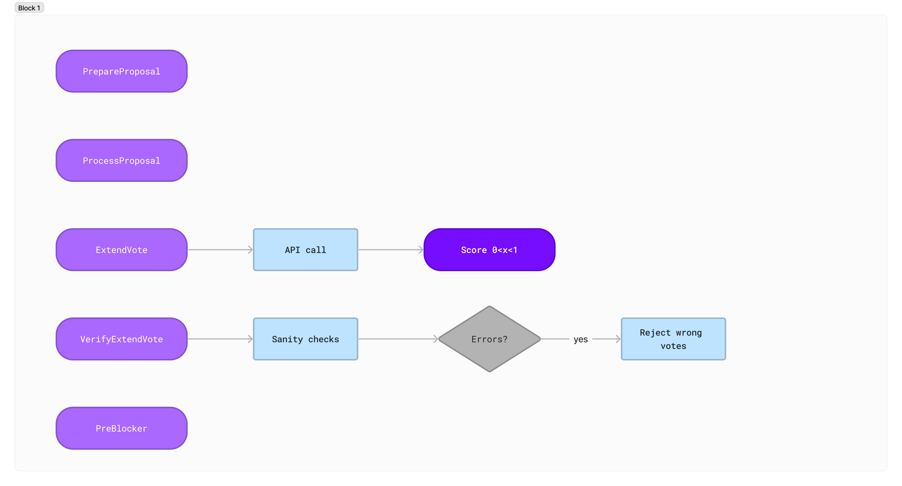
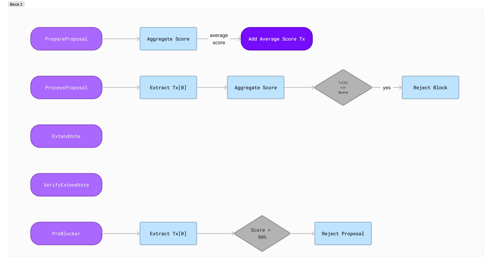
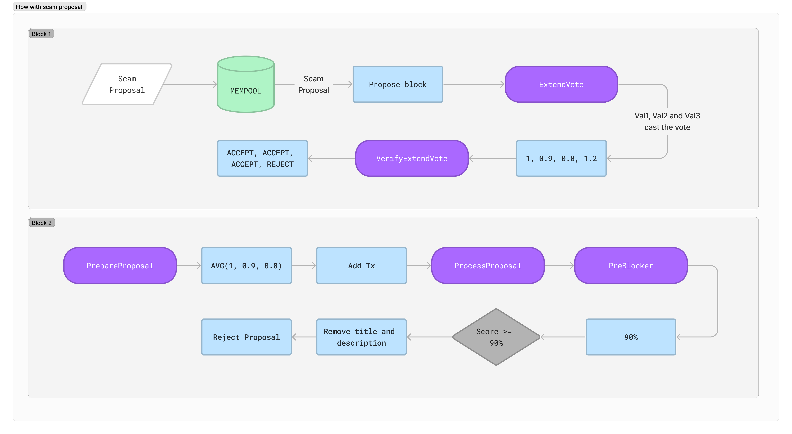

# ABCAI-moderator

**ABCAI-moderator filters spam governance proposals so that team does not have to waste their precious time in these boring activities.**

## The Problem

Right now, when a scam proposal is published on-chain, the team has to manually removed it,
wasting their time. Also it's a big problem for users that could get scammed by those fraudulent
proposals and this could also bring a bad reputation for the project itself.

## Our Solution

What we do is to make use of the latest technology of ABCI++, Cosmos SDK v0.50 and AI in
order to automatically detect scam proposals and delete them just after one block from when they
are published.

## In-depth Explanation

A little overview of ABCI++ is needed to understand how we code this project.

ABCI++ is the bridge between CometBFT, the consensus protocol, and the application itself, the state machine. Until ABCI++, app developers couldn't implement custom logic
in the first phases of the creation of a block, for example using a different transaction inserting algorithm or other more complex stuff.

ABCI++ unlocks all these possibilieties. In particular there are 5 moments where CometBFT and the state machine can communicate in order to implement custm logic:

### Prepare Proposal

The proposer can add some data or computation in the block building.

### Process Proposal

All validators verify that the proposer is behaving properly.

### Extend Vote

All validators can add extra votes or computation in the block.

### Verify Vote Extension

All validators verify that other validators have behaved properly during the precedence phase.

### PreBlocker

The last phase where validators can apply some custom logic.

## How It Works + Workflows

It all happens in a two-blocks sequence:

### Block 1

- **ExtendVote**: validators make an API call to OpenAI that returns a score between 0 from 1 that is then normalized between 0 to 100.

- **VerifyExtendVote**: validators some simple sanity checks, like checking if the score is between 0 and 100.

### Block 2

- **PrepareProposal**: proposer aggregates all the validators' scores and computes the average.

- **ProcessProposal**: validators check if proposer did the work correctly.

- **PreBlocker**: validators check if scam score is greater than 90% and if so they reject the proposal.

### Scam Proposal Workflow

This is an example of a workflow of a scam proposal that fets published on-chain.

